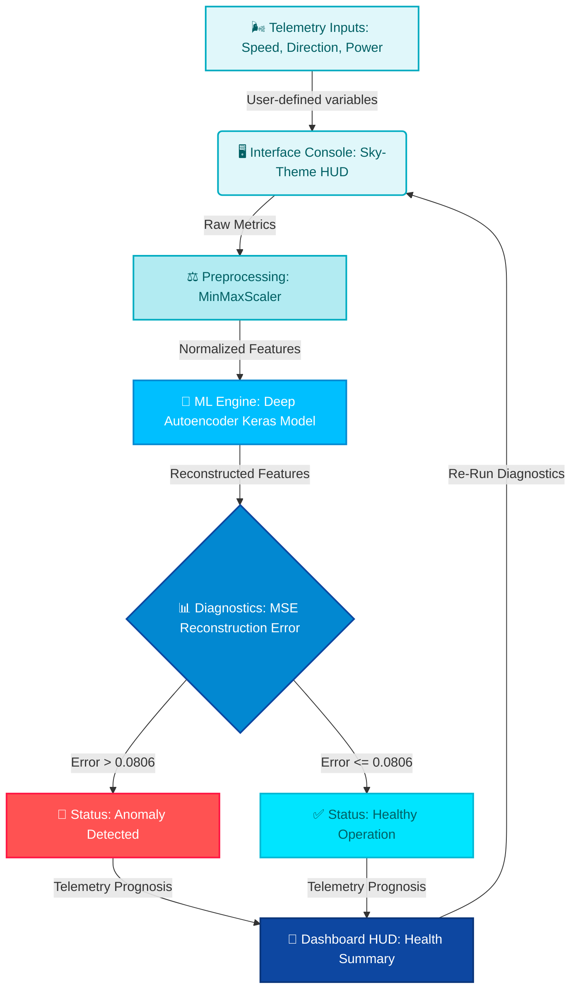

# AeroFlow AI — Wind Turbine Intelligent Diagnostics & Anomaly Studio

### 🌬️ **Predictive Health & Telemetry Analytics for the Renewable Energy Era**


---

### **Where Renewable Energy Science Meets Generative Deep Learning.**
**AeroFlow AI Anomaly Studio** evaluates wind turbine telemetry and detects operational failures in real time. Designed for wind farm technicians, maintenance supervisors, and asset operators. 🌪️⚙️

---

## 🎯 **PROJECT ESSENTIALS**

### 1. 🔍 What is the Project?
**AeroFlow AI** is a machine learning-driven diagnostic application designed to monitor the operational health of wind turbines. It leverages historical telemetry data and neural networks to understand the baseline of a turbine operating under normal, healthy conditions.

### 2. 🛠️ What is Being Made?
* **A Deep Autoencoder Neural Network:** A TensorFlow/Keras model trained solely on healthy turbine telemetry data (Wind Speed vs. Active Power) to recognize standard operational dynamics and flag reconstruction deviations.
* **An Interactive Streamlit HUD:** A real-time telemetry console with a dynamic sky theme, custom glassmorphism style, and an interactive windmill animation synced to wind speed inputs.

### 3. 🛡️ What Problem is Being Solved?
* **Failed & Delayed Fault Detection:** Traditional wind turbine inspections are reactive, occurring only *after* a major breakdown.
* **High Maintenance & Operational Costs:** Undetected mechanical faults (e.g., blade degradation, gear wear) cause massive power drops, energy loss, and high repair costs. AeroFlow AI detects these performance drops early, saving an estimated **15-20%** in operational costs and preventing emergency downtime.

---

## ⚡ **MAINTENANCE 3.1: THE DIGITAL Renewables REVOLUTION**

In the modern **Renewable Energy 3.1** landscape, manual wind turbine inspections are costly, dangerous, and reactive. Modern wind farms require predictive telemetry analytics to catch faults before they trigger catastrophic mechanical breakdowns. 

**AeroFlow AI** solves the high overhead of physical inspections and sensor downtime. By feeding real-time turbine metrics (Wind Speed and Active Power) into a custom-trained **Deep Autoencoder Neural Network**, it learns the boundary of optimal operation. It flags anomalies instantly when performance drifts due to blade wear, mechanical friction, yaw misalignments, or grid constraints.

---

## 📊 **WIND DIAGNOSTIC MATRIX & REGIME PRESETS**

AeroFlow AI separates turbine status into specific operational regimes, scaling the evaluation based on atmospheric conditions and power profiles:

| Operating Regime | Typical Wind Range | ML Evaluation Model | Diagnostic Indicators & Warnings |
| :--- | :--- | :--- | :--- |
| **Low Wind Standby** 💤 | 0.0 - 3.0 m/s | Bypassed (Normal) | Blades stationary/idling. Low output expected; ML alerts disabled. |
| **Optimal Generation** ✨ | 3.0 - 15.0 m/s | Deep Autoencoder | Normal reconstruction error (< 0.0806). Power matches expected profile. |
| **High Wind Load** 🌪️ | 15.0 - 25.0 m/s | Deep Autoencoder | Evaluates structural efficiency under high stress. Dynamic braking checks. |
| **Danger Over-speed** ⚠️ | > 25.0 m/s | Bypassed (Safety Trigger) | Critical over-speed threshold. High risk of mechanical stress; emergency shutdown. |

---

## ⚡ **SYSTEM ARCHITECTURE FLOW**

The diagram below outlines the pipeline flow from the Streamlit interface, preprocessing layer, Autoencoder prediction, and HUD updates:



---

## 🔬 **DEEP AUTOENCODER SPOTLIGHT**

Under the hood, AeroFlow AI evaluates the correlation between wind speed and electrical power. The autoencoder learns to reconstruct input data that aligns with healthy historical performance.

```python
# Autoencoder Anomaly Scoring pipeline
def check_turbine_health(wind_speed, actual_power):
    # 1. Scale the incoming real-time telemetry
    new_data = scaler.transform([[wind_speed, actual_power]])

    # 2. Get reconstruction prediction
    reconstructed = autoencoder.predict(new_data)
    
    # 3. Calculate Mean Squared Error (MSE) reconstruction loss
    error = np.mean(np.power(new_data - reconstructed, 2))

    # 4. Compare to statistical healthy threshold (0.0806)
    if error > 0.0806:
        return "🚨 ALERT: Anomaly Detected!"
    else:
        return "✅ Status: Healthy"
```

*During operation, mechanical issues causing decreased power production under strong wind conditions will lead to high reconstruction losses, immediately triggering alerts.*

---

## 🛠️ **TECHNOLOGY STACK**

```
 🖥️ Interface  --->   Streamlit (Glassmorphic Sky-Theme HUD)
 🧠 ML Engine  --->   Python 3.8+ / TensorFlow / Keras (Autoencoder)
 📊 Scaling     --->   Scikit-Learn (MinMaxScaler / Joblib)
 💾 Database    --->   Local Telemetry Dataset (T1.csv)
```

* **Streamlit**: Renders the glassmorphic cloud dashboard featuring Outfit typography, dynamic SVG windmill rotation, and interactive telemetry dials.
* **TensorFlow/Keras**: Runs the pre-trained autoencoder neural network models for real-time inference.
* **Scikit-Learn & Joblib**: Standardizes the inputs with fitted MinMaxScaler coefficients to keep predictions accurate.

---

## 📂 **PROJECT BLUEPRINT**

```text
turbine-anomaly-autoencoder/
│
├── 📜 app.py                        # Streamlit Sky-Theme UI controller & SVG animation
├── 📜 main.py                       # Training pipeline (autoencoder definitions & evaluation)
├── 📜 main.ipynb                    # Development notebook for dataset exploration
│
├── 📊 T1.csv                        # Historical turbine telemetry dataset (50k+ records)
├── 🤖 turbine_model.h5              # Trained Keras autoencoder model weights
├── ⚖️ scaler.pkl                    # MinMaxScaler serialization coefficients
│
├── 📜 .gitignore                    # Local ignore configurations
├── 📜 requirements.txt              # Standard package requirements
└── 📖 README.md                     # Studio Documentation (You are here!)
```

*File Navigation Links:*
* Dashboard Entrypoint: [app.py](file:///c:/my_local_data%28one%20drive%29/Attachments/Ambition%20course/my_all_projects/project%2070%20wind%20health%20checker/app.py)
* Model Training Code: [main.py](file:///c:/my_local_data%28one%20drive%29/Attachments/Ambition%20course/my_all_projects/project%2070%20wind%20health%20checker/main.py)
* Interactive Notebook: [main.ipynb](file:///c:/my_local_data%28one%20drive%29/Attachments/Ambition%20course/my_all_projects/project%2070%20wind%20health%20checker/main.ipynb)

---

## 🚀 **GETTING STARTED & LAUNCH GUIDE**

Follow these quick steps to get the AeroFlow AI Studio running locally:

### **1. Enter Directory**
Open your terminal and navigate to the project root:
```powershell
cd "project 70 wind health checker"
```

### **2. Install Dependencies**
Install all required libraries using pip:
```powershell
pip install streamlit pandas numpy tensorflow scikit-learn joblib plotly nbformat
```

### **3. Launch the Diagnostics Studio**
Run the Streamlit application:
```powershell
streamlit run app.py
```
Open your browser and navigate to:
👉 **`http://localhost:8501`**

---

## 👨‍🍳 **CONNECT WITH THE ENGINEER**

<div align="center">

[](https://github.com/mayank-goyal09)
[](https://www.linkedin.com/in/mayank-goyal-4b8756363/)
[](https://mayank-goyal09.github.io/)

**Mayank Goyal**  
🧠 GenAI & Automation Developer | 🌬️ Predictive Asset Architect | 🤖 Renewable Automation Engineer

</div>

---

<div align="center">

### **Crafted with ❤️ by Mayank Goyal**
*"Analyze the atmosphere. Protect the future."* 🌬️⚡💻

</div>
