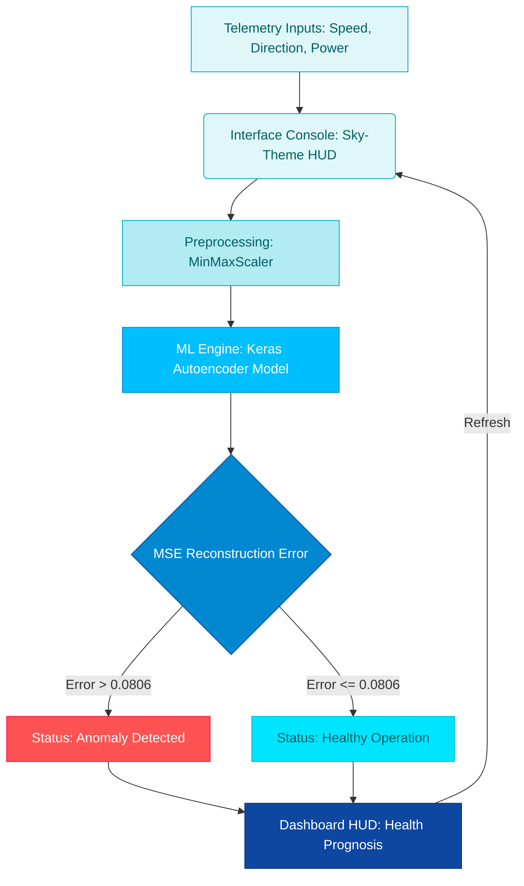

# AeroFlow AI

> **Real-time wind turbine anomaly detection using deep autoencoders.**


---

## Project Essentials

* **Purpose:** Monitors wind turbine health in real-time to prevent catastrophic mechanical breakdowns.
* **Mechanism:** TensorFlow-based deep autoencoder trained exclusively on healthy operational data.
* **Inference:** Compares real-time telemetry against expected performance. High reconstruction error (> 0.0806) flags anomalies.
* **Business Value:** Prevents unexpected downtime and reduces maintenance costs by 15-20%.

---

## Wind Operational Matrix

| Regime | Wind Range | ML Evaluation | System Status & Action |
| :--- | :--- | :--- | :--- |
| **Low Wind Standby** | 0.0 - 3.0 m/s | Bypassed | Turbine idling. Alerts disabled. |
| **Optimal Generation** | 3.0 - 15.0 m/s | Active | Nominal tracking against theoretical curves. |
| **High Wind Load** | 15.0 - 25.0 m/s | Active | Verifies performance under peak stress conditions. |
| **Storm Cut-Out** | > 25.0 m/s | Bypassed | Safety shut-down. Emergency braking diagnostics. |

---

## System Architecture



---

## ML Reconstruction Logic

```python
# Normalize inputs and compute reconstruction error
scaled_input = scaler.transform([[wind_speed, active_power]])
reconstructed = model.predict(scaled_input)
reconstruction_error = np.mean(np.power(scaled_input - reconstructed, 2))

# Flag anomaly if drift exceeds established healthy baseline
is_anomaly = reconstruction_error > 0.0806
```

---

## Technical Stack

* **Frontend:** Streamlit (Glassmorphic Sky HUD)
* **ML Framework:** TensorFlow / Keras (Autoencoder neural network)
* **Preprocessing:** Scikit-Learn (MinMaxScaler)
* **Dataset:** Historical Telemetry Log (`T1.csv`)

---

## File Blueprint

```text
turbine-anomaly-autoencoder/
├── app.py              # Streamlit Sky-Theme dashboard & SVG animation
├── main.py             # Training pipeline & model threshold calibration
├── main.ipynb          # Jupyter Notebook for experimental model building
├── T1.csv              # Turbine telemetry raw dataset (50k+ rows)
├── turbine_model.h5    # Trained Keras Autoencoder model
└── scaler.pkl          # MinMaxScaler serialization pickle
```

*Quick Links:*
[Dashboard Entrypoint](file:///c:/my_local_data%28one%20drive%29/Attachments/Ambition%20course/my_all_projects/project%2070%20wind%20health%20checker/app.py) | [Model Training](file:///c:/my_local_data%28one%20drive%29/Attachments/Ambition%20course/my_all_projects/project%2070%20wind%20health%20checker/main.py) | [Experiment Notebook](file:///c:/my_local_data%28one%20drive%29/Attachments/Ambition%20course/my_all_projects/project%2070%20wind%20health%20checker/main.ipynb)

---

## Getting Started

1. **Install required packages:**
   ```bash
   pip install streamlit pandas numpy tensorflow scikit-learn joblib
   ```

2. **Launch the dashboard:**
   ```bash
   streamlit run app.py
   ```
   Access the UI at `http://localhost:8501`.

---

## Developer
**Mayank Goyal**  
GenAI & Automation Developer | Predictive Asset Architect  
[GitHub](https://github.com/mayank-goyal09) | [LinkedIn](https://www.linkedin.com/in/mayank-goyal-4b8756363/)
